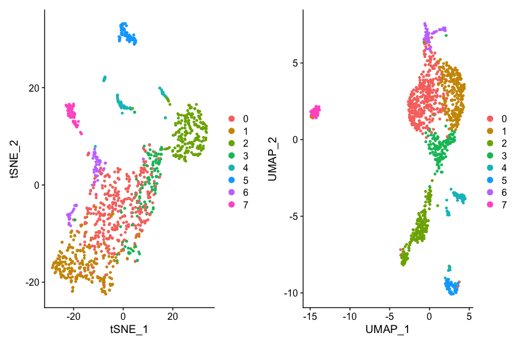
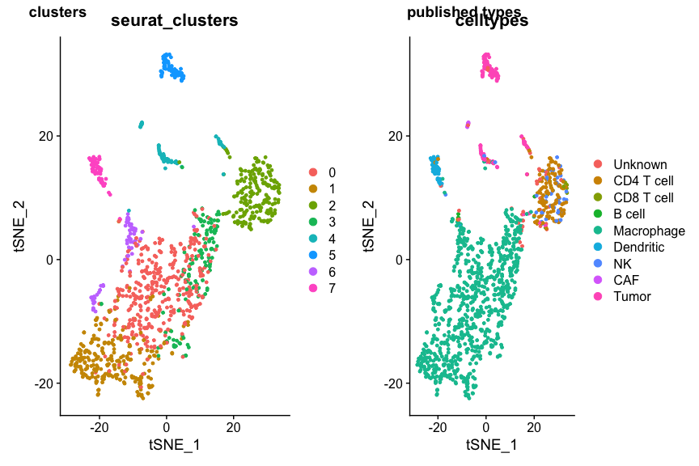

Cell type identification
================

Created by: Philip Lijnzaad

# Overview

In any single-cell experiment where mixed populations are expected, a
very important task is to identify the cell types (and/or cell states)
that are present. In this practical, we will look at two tools for doing
this: SingleR ([Aran et
al. 2019](https://www.nature.com/articles/s41590-018-0276-y)) and CHETAH
([de Kanter et al., under review](http://dx.doi.org/10.1101/558908)).

# Datasets

We will try to classify the ovarian ascites data from [Schelker et
al. 2017](https://www.nature.com/articles/s41467-017-02289-3) using, as
a reference, the different reference data sets from both SingleR and
CHETAH.

The `ovarian1200` dataset contains 1200 cells randomly selected from the
3114 single cell data provided by Schelker et al. (which is available
from <https://figshare.com/s/711d3fb2bd3288c8483>). The data come from
the ascites of 4 different ovarian cancer patients and contain a variety
of leukocytes as well as tumor cells.

First load the various packages:

``` r
suppressMessages(require(SingleCellExperiment))
suppressMessages(require(Seurat))
suppressMessages(require(CHETAH))
suppressMessages(require(Matrix))
suppressMessages(require(SingleR))
suppressMessages(require(cowplot))
```

If you have (or downloaded) the ovarian data into folder `data.dir` then
load the `Seurat` object with

``` r
#load expression matrix

data.dir <- "session-celltypeid_files" # or wherever the data is located
file <- paste0(data.dir,"/ovarian1200.rds")
ovarian <- readRDS(file=file)
```

The authors already classified the cells ‘by hand’ using marker genes.
This classfication can be found in the `celltypes` column of the
`meta.data` of the object. Get an overview of this:

``` r
head(ovarian@meta.data)
```

    ##            nGene  nUMI    orig.ident  celltypes nCount_RNA nFeature_RNA
    ## X7873M.1    3563 11796 SeuratProject Macrophage      11796         3563
    ## X7873M.10   3442 12026 SeuratProject Macrophage      12026         3442
    ## X7873M.102  5176 22370 SeuratProject Macrophage      22370         5176
    ## X7873M.108  2836  8267 SeuratProject Macrophage       8267         2836
    ## X7873M.112  2168  4798 SeuratProject    Unknown       4798         2168
    ## X7873M.118  5292 18172 SeuratProject Macrophage      18172         5292

``` r
sort(table(ovarian@meta.data$celltypes))
```

    ## 
    ## reg. T cell      B cell         CAF  CD8 T cell          NK     Unknown   Dendritic       Tumor  CD4 T cell  Macrophage 
    ##           0           5          10          12          42          43          49         114         126         799

Clearly, most of the cells are Macrophages.

We now follow the ‘standard’ [Seurat
workflow](https://satijalab.org/seurat/essential_commands.html#seurat-standard-worflow)
to prepare the data.

``` r
ovarian <- NormalizeData(object = ovarian)
ovarian <- FindVariableFeatures(object = ovarian)
ovarian <- ScaleData(object = ovarian)
```

    ## Centering and scaling data matrix

``` r
ovarian <- RunPCA(object = ovarian, npcs=20)
```

    ## PC_ 1 
    ## Positive:  HLA-DRA, FTL, LYZ, HLA-DPA1, FABP5, S100A8, VSIG4, MARCO, SPP1, HLA-DPB1 
    ##     CTSL, HLA-DQB1, CCL2, CTSB, TIMP1, NPL, SELL, LGMN, S100A9, OLR1 
    ##     FN1, RNASE1, C1QA, HLA-DQA1, RGCC, DAB2, FPR3, C1QB, PLAC8, LYVE1 
    ## Negative:  TACSTD2, KRT19, KRT18, SLPI, LCN2, KRT18P55, TM4SF1, KRT7, MAL2, CRYAB 
    ##     MUC4, KLK6, WFDC2, S100A16, CLDN1, CLDN4, PXDN, MDK, DHCR24, CLDN3 
    ##     UCA1, NBL1, PERP, ASS1, GNG12, C19orf33, DCBLD2, VSTM2L, EPCAM, SCNN1A 
    ## PC_ 2 
    ## Positive:  LCN2, MUC4, TACSTD2, KLK6, VSTM2L, CAMK2N1, SCNN1A, UCA1, CLDN4, MAL 
    ##     INHBB, TSPAN1, MAL2, MUC20, CLDN3, FOLR1, C19orf33, SPOCK2, NTN4, KLK5 
    ##     KRT4, SPINT1, S100A14, KRT80, LAD1, EPCAM, RAB25, LMO7, KLK7, GJB3 
    ## Negative:  C1S, COL3A1, CALB2, SPARC, C1R, COL5A2, COL1A2, ANXA8, EGFL6, LOX 
    ##     PTGIS, COL6A1, C4B, CEMIP, ALDH1A2, C4A, ANXA8L1, PAPPA, IGFBP4, MYH10 
    ##     COL5A1, XXbac-BPG116M5.17, C1QL1, CFB, PROCR, HAS1, FAM101A, GAS1, KDR, MEDAG 
    ## PC_ 3 
    ## Positive:  CTSB, FTL, CTSL, VSIG4, FABP5, SPP1, MARCO, CTSD, PLTP, TIMP1 
    ##     FN1, C1QA, RNASE1, ANXA2, C1QB, NPL, C1QC, CCL2, FTH1, S100A9 
    ##     LGMN, S100A8, DAB2, LYVE1, APOE, SDC3, IDH1, GPNMB, LYZ, APOC1 
    ## Negative:  LTB, IFITM1, TRBC2, TRBC1, GZMB, SLC38A1, MIAT, IL7R, SELL, TRAC 
    ##     JCHAIN, CCL5, IGKC, CD2, GZMA, IL2RB, GZMK, BCL11B, CXCR4, LILRA4 
    ##     SPOCK2, C12orf75, DERL3, CCR7, SERPINF1, SMPD3, PLD4, EIF4B, ITM2C, SCAMP5 
    ## PC_ 4 
    ## Positive:  UCHL1, TUBB2B, PEG10, CTHRC1, MYBL2, IGFBP2, ADGRL2, SQLE, TOP2A, STMN1 
    ##     CRABP2, FBLN1, KIFC1, CKB, CKS1B, UBE2C, SIX3, RRM2, AURKB, TYMS 
    ##     KIF1A, CDC20, PTTG1, HMGCS1, C12orf75, CDCA8, TPD52L1, CDK1, MKI67, ANLN 
    ## Negative:  VSTM2L, PDZK1IP1, C3, MUC4, MSLN, C10orf10, KLK11, LMO7, DHRS9, TGM2 
    ##     CAMK2N1, VWA5A, MAL, GPRC5A, LCN2, LY6E, SPOCK2, PXDN, CFB, VGLL1 
    ##     KRT4, XXbac-BPG116M5.17, DPP6, AHNAK, FAM83A, NTN4, IFI27, MUC20, SNCG, FOLR1 
    ## PC_ 5 
    ## Positive:  IFITM1, TRBC2, CCL5, MIAT, TRBC1, IL2RB, GZMA, IL7R, GZMK, TRAC 
    ##     BCL11B, CD2, HMGB2, SPOCK2, PRF1, RARRES3, UCHL1, PRKCH, KLRB1, ITM2A 
    ##     IGFBP2, NKG7, ITK, PEG10, MT-ND4L, CDKN2A, CD8A, GNLY, CTHRC1, TUBB2B 
    ## Negative:  JCHAIN, GZMB, IGKC, LILRA4, PLD4, DERL3, SERPINF1, TSPAN13, IRF8, IRF7 
    ##     SCAMP5, LRRC26, CYB561A3, CCDC50, SMPD3, TCF4, UGCG, PACSIN1, TCL1A, GPM6B 
    ##     PLAC8, HLA-DRA, ITM2C, PTGDS, HLA-DPA1, C12orf75, IGHM, PPM1J, HLA-DPB1, HLA-DQB1

``` r
ovarian <- FindNeighbors(object = ovarian)
```

    ## Computing nearest neighbor graph

    ## Computing SNN

``` r
ovarian <- FindClusters(object = ovarian, resolution=0.5) 
```

    ## Modularity Optimizer version 1.3.0 by Ludo Waltman and Nees Jan van Eck
    ## 
    ## Number of nodes: 1200
    ## Number of edges: 38517
    ## 
    ## Running Louvain algorithm...
    ## Maximum modularity in 10 random starts: 0.8547
    ## Number of communities: 8
    ## Elapsed time: 0 seconds

``` r
## (the default resolution yields too manh clusters)
ovarian <- RunTSNE(object = ovarian)
ovarian <- RunUMAP(object = ovarian, dims=1:20)
```

    ## 10:23:37 UMAP embedding parameters a = 0.9922 b = 1.112

    ## 10:23:37 Read 1200 rows and found 20 numeric columns

    ## 10:23:37 Using Annoy for neighbor search, n_neighbors = 30

    ## 10:23:37 Building Annoy index with metric = cosine, n_trees = 50

    ## 0%   10   20   30   40   50   60   70   80   90   100%

    ## [----|----|----|----|----|----|----|----|----|----|

    ## **************************************************|
    ## 10:23:37 Writing NN index file to temp file /var/folders/3w/96qhhcf50z1g9k0fhrh6j7j80000gp/T//RtmpnxwsKY/file1d9e72b01a6a
    ## 10:23:37 Searching Annoy index using 1 thread, search_k = 3000
    ## 10:23:37 Annoy recall = 100%
    ## 10:23:38 Commencing smooth kNN distance calibration using 1 thread
    ## 10:23:39 Initializing from normalized Laplacian + noise
    ## 10:23:39 Commencing optimization for 500 epochs, with 48074 positive edges
    ## 10:23:41 Optimization finished

``` r
p1 <- DimPlot(ovarian, reduction='tsne')
p2 <- DimPlot(ovarian, reduction='umap')
plot_grid(p1, p2)
```

<!-- -->

This shows the data with Seurat clustering, but we’re more interested in
the cell types. Let’s see if and how they coincide. For convenience and
flexibility, we define `dim.red` to be our dimension reduction of
choice.

``` r
dim.red <- 'tsne' # or 'umap' or 'pca'
p1 <- DimPlot(ovarian, group.by="seurat_clusters", reduction=dim.red)
p2 <- DimPlot(ovarian, group.by='celltypes', reduction=dim.red)
plot_grid(p1, p2, labels=c('clusters', 'published types'))
```

<!-- -->

# SingleR

## SingleR reference data sets

We will now do our cell type identification using SingleR. SingleR comes
with a collection of reference data sets. There are two for human:
`hpca`, the Human Primary Cell Atlas (microarray-based), and
`blueprint\_encode`, a combined Blueprint Epigenomics and Encode data
set (RNASeq based) .

For mouse there are also two sets: `immgen`, the Immunological Genome
Project (microarray-based) and `mouse.rnaseq`, a brain specific
reference (RNASeq-based). For details I refer to the
SingleR-specifications vignette.

Each reference data set comes in two ‘flavours’: ‘label.fine’, which are
very fine-grained, detailed types, and ‘label.main’, which are a coarser
subset of those types.

The SingleR reference data sets are part of the package, and can be
explored easily.

``` r
warning("now using celldex!")
```

    ## Warning: now using celldex!

``` r
library(celldex)
```

    ## 
    ## Attaching package: 'celldex'

    ## The following objects are masked from 'package:SingleR':
    ## 
    ##     BlueprintEncodeData, DatabaseImmuneCellExpressionData, HumanPrimaryCellAtlasData, ImmGenData, MonacoImmuneData, MouseRNAseqData, NovershternHematopoieticData

``` r
hpca <- HumanPrimaryCellAtlasData()
```

    ## snapshotDate(): 2021-10-19

    ## see ?celldex and browseVignettes('celldex') for documentation

    ## loading from cache

    ## see ?celldex and browseVignettes('celldex') for documentation

    ## loading from cache

``` r
table(hpca$label.main)
```

    ## 
    ##            Astrocyte                   BM           BM & Prog.               B_cell                  CMP         Chondrocytes                   DC Embryonic_stem_cells    Endothelial_cells     Epithelial_cells         Erythroblast          Fibroblasts                  GMP          Gametocytes           HSC_-G-CSF            HSC_CD34+          Hepatocytes        Keratinocytes                  MEP                  MSC           Macrophage             Monocyte            Myelocyte              NK_cell Neuroepithelial_cell              Neurons          Neutrophils          Osteoblasts            Platelets     Pre-B_cell_CD34-     Pro-B_cell_CD34+        Pro-Myelocyte  Smooth_muscle_cells              T_cells    Tissue_stem_cells            iPS_cells 
    ##                    2                    7                    1                   26                    2                    8                   88                   17                   64                   16                    8                   10                    2                    5                   10                    6                    3                   25                    2                    9                   90                   60                    2                    5                    1                   16                   21                   15                    5                    2                    2                    2                   16                   68                   55                   42

``` r
table(hpca$label.fine)
```

    ## 
    ##                  Astrocyte:Embryonic_stem_cell-derived                                                     BM                                                 B_cell                              B_cell:CXCR4+_centroblast                               B_cell:CXCR4-_centrocyte                                 B_cell:Germinal_center                                          B_cell:Memory                                           B_cell:Naive                                     B_cell:Plasma_cell                                        B_cell:immature                                                    CMP                               Chondrocytes:MSC-derived                                    DC:monocyte-derived         DC:monocyte-derived:A._fumigatus_germ_tubes_6h                    DC:monocyte-derived:AEC-conditioned                              DC:monocyte-derived:AM580                              DC:monocyte-derived:CD40L                         DC:monocyte-derived:Galectin-1 
    ##                                                      2                                                      8                                                      4                                                      4                                                      4                                                      3                                                      3                                                      3                                                      3                                                      2                                                      2                                                      8                                                     19                                                      2                                                      5                                                      3                                                      3                                                      3 
    ##                                DC:monocyte-derived:LPS                           DC:monocyte-derived:Poly(IC)                  DC:monocyte-derived:Schuler_treatment                    DC:monocyte-derived:anti-DC-SIGN_2h                    DC:monocyte-derived:antiCD40/VAF347                           DC:monocyte-derived:immature                             DC:monocyte-derived:mature                      DC:monocyte-derived:rosiglitazone            DC:monocyte-derived:rosiglitazone/AGN193109                                   Embryonic_stem_cells                                Endothelial_cells:HUVEC                Endothelial_cells:HUVEC:B._anthracis_LT           Endothelial_cells:HUVEC:Borrelia_burgdorferi                   Endothelial_cells:HUVEC:FPV-infected                  Endothelial_cells:HUVEC:H5N1-infected                           Endothelial_cells:HUVEC:IFNg                          Endothelial_cells:HUVEC:IL-1b                   Endothelial_cells:HUVEC:PR8-infected 
    ##                                                      6                                                      3                                                      3                                                      3                                                      2                                                     20                                                     11                                                      3                                                      2                                                     17                                                     16                                                      2                                                      2                                                      3                                                      3                                                      1                                                      3                                                      3 
    ##                Endothelial_cells:HUVEC:Serum_Amyloid_A                           Endothelial_cells:HUVEC:VEGF                         Endothelial_cells:blood_vessel                            Endothelial_cells:lymphatic                       Endothelial_cells:lymphatic:KSHV                   Endothelial_cells:lymphatic:TNFa_48h                               Epithelial_cells:bladder                             Epithelial_cells:bronchial                                           Erythroblast                                     Fibroblasts:breast                                   Fibroblasts:foreskin                                                    GMP                                     Gametocytes:oocyte                               Gametocytes:spermatocyte                                             HSC_-G-CSF                                              HSC_CD34+                                            Hepatocytes                                          Keratinocytes 
    ##                                                      6                                                      3                                                      8                                                      7                                                      4                                                      3                                                      6                                                     10                                                      8                                                      6                                                      4                                                      2                                                      3                                                      2                                                     10                                                      6                                                      3                                                      3 
    ##                                     Keratinocytes:IFNg                                     Keratinocytes:IL19                                     Keratinocytes:IL1b                                     Keratinocytes:IL20                                     Keratinocytes:IL22                                     Keratinocytes:IL24                                     Keratinocytes:IL26                                      Keratinocytes:KGF                                                    MEP                                                    MSC                                    Macrophage:Alveolar                 Macrophage:Alveolar:B._anthacis_spores                            Macrophage:monocyte-derived                       Macrophage:monocyte-derived:IFNa              Macrophage:monocyte-derived:IL-4/Dex/TGFb             Macrophage:monocyte-derived:IL-4/Dex/cntrl                  Macrophage:monocyte-derived:IL-4/TGFb                 Macrophage:monocyte-derived:IL-4/cntrl 
    ##                                                      2                                                      3                                                      2                                                      3                                                      3                                                      3                                                      3                                                      3                                                      2                                                      9                                                      4                                                      3                                                     26                                                      9                                                     10                                                      5                                                      5                                                      5 
    ##                      Macrophage:monocyte-derived:M-CSF                 Macrophage:monocyte-derived:M-CSF/IFNg         Macrophage:monocyte-derived:M-CSF/IFNg/Pam3Cys              Macrophage:monocyte-derived:M-CSF/Pam3Cys                  Macrophage:monocyte-derived:S._aureus                                               Monocyte                                         Monocyte:CD14+                                         Monocyte:CD16+                                         Monocyte:CD16-                                         Monocyte:CXCL4                        Monocyte:F._tularensis_novicida                                          Monocyte:MCSF                      Monocyte:S._typhimurium_flagellin                                  Monocyte:anti-FcgRIIB                                Monocyte:leukotriene_D4                                              Myelocyte                                                NK_cell                                   NK_cell:CD56hiCD62L+ 
    ##                                                      2                                                      2                                                      2                                                      2                                                     15                                                     27                                                      3                                                      6                                                      7                                                      2                                                      6                                                      2                                                      1                                                      2                                                      4                                                      2                                                      1                                                      1 
    ##                                            NK_cell:IL2                       Neuroepithelial_cell:ESC-derived               Neurons:ES_cell-derived_neural_precursor                                   Neurons:Schwann_cell                      Neurons:adrenal_medulla_cell_line                                             Neutrophil                                 Neutrophil:GM-CSF_IFNg                                         Neutrophil:LPS                    Neutrophil:commensal_E._coli_MG1655                                      Neutrophil:inflam                 Neutrophil:uropathogenic_E._coli_UTI89                                            Osteoblasts                                       Osteoblasts:BMP2                                              Platelets                                       Pre-B_cell_CD34-                                       Pro-B_cell_CD34+                                          Pro-Myelocyte                          Smooth_muscle_cells:bronchial 
    ##                                                      3                                                      1                                                      6                                                      4                                                      6                                                      6                                                      4                                                      4                                                      2                                                      4                                                      1                                                      9                                                      6                                                      5                                                      2                                                      2                                                      2                                                      3 
    ##                    Smooth_muscle_cells:bronchial:vit_D                     Smooth_muscle_cells:umbilical_vein                           Smooth_muscle_cells:vascular                     Smooth_muscle_cells:vascular:IL-17                T_cell:CCR10+CLA+1,25(OH)2_vit_D3/IL-12                T_cell:CCR10-CLA+1,25(OH)2_vit_D3/IL-12                                            T_cell:CD4+                                      T_cell:CD4+_Naive                             T_cell:CD4+_central_memory                            T_cell:CD4+_effector_memory                                            T_cell:CD8+                             T_cell:CD8+_Central_memory                            T_cell:CD8+_effector_memory                         T_cell:CD8+_effector_memory_RA                                      T_cell:CD8+_naive                                      T_cell:Treg:Naive                                        T_cell:effector                                     T_cell:gamma-delta 
    ##                                                      3                                                      2                                                      5                                                      3                                                      1                                                      1                                                     12                                                      6                                                      5                                                      4                                                     16                                                      3                                                      4                                                      4                                                      4                                                      2                                                      4                                                      2 
    ##                               Tissue_stem_cells:BM_MSC                          Tissue_stem_cells:BM_MSC:BMP2                         Tissue_stem_cells:BM_MSC:TGFb3                    Tissue_stem_cells:BM_MSC:osteogenic                          Tissue_stem_cells:CD326-CD56+              Tissue_stem_cells:adipose-derived_MSC_AM3                          Tissue_stem_cells:dental_pulp                            Tissue_stem_cells:iliac_MSC                   Tissue_stem_cells:lipoma-derived_MSC                             iPS_cells:CRL2097_foreskin    iPS_cells:CRL2097_foreskin-derived:d20_hepatic_diff             iPS_cells:CRL2097_foreskin-derived:undiff.                           iPS_cells:PDB_1lox-17Puro-10                            iPS_cells:PDB_1lox-17Puro-5                           iPS_cells:PDB_1lox-21Puro-20                           iPS_cells:PDB_1lox-21Puro-26                                  iPS_cells:PDB_2lox-17                                  iPS_cells:PDB_2lox-21 
    ##                                                      8                                                     12                                                     11                                                      8                                                      3                                                      2                                                      6                                                      3                                                      2                                                      3                                                      3                                                      3                                                      1                                                      1                                                      1                                                      1                                                      1                                                      1 
    ##                                  iPS_cells:PDB_2lox-22                                   iPS_cells:PDB_2lox-5                              iPS_cells:PDB_fibroblasts         iPS_cells:adipose_stem_cell-derived:lentiviral iPS_cells:adipose_stem_cell-derived:minicircle-derived                           iPS_cells:adipose_stem_cells        iPS_cells:fibroblast-derived:Direct_del._reprog         iPS_cells:fibroblast-derived:Retroviral_transf                                  iPS_cells:fibroblasts                          iPS_cells:foreskin_fibrobasts                       iPS_cells:iPS:minicircle-derived                              iPS_cells:skin_fibroblast                      iPS_cells:skin_fibroblast-derived 
    ##                                                      1                                                      1                                                      1                                                      3                                                      3                                                      3                                                      2                                                      1                                                      1                                                      1                                                      5                                                      2                                                      3

``` r
bpe <- BlueprintEncodeData()
```

    ## snapshotDate(): 2021-10-19

    ## see ?celldex and browseVignettes('celldex') for documentation

    ## loading from cache

    ## see ?celldex and browseVignettes('celldex') for documentation

    ## loading from cache

``` r
table(bpe$label.main)
```

    ## 
    ##        Adipocytes        Astrocytes           B-cells      CD4+ T-cells      CD8+ T-cells      Chondrocytes                DC Endothelial cells       Eosinophils  Epithelial cells      Erythrocytes       Fibroblasts               HSC     Keratinocytes       Macrophages       Melanocytes   Mesangial cells         Monocytes          Myocytes          NK cells           Neurons       Neutrophils         Pericytes   Skeletal muscle     Smooth muscle 
    ##                 9                 2                 8                14                 5                 2                 1                26                 1                18                 7                20                38                 2                25                 4                 2                16                 4                 3                 4                23                 2                 7                16

``` r
table(bpe$label.fine)
```

    ## 
    ##                    Adipocytes                    Astrocytes                  CD4+ T-cells                      CD4+ Tcm                      CD4+ Tem                  CD8+ T-cells                      CD8+ Tcm                      CD8+ Tem                           CLP                           CMP                  Chondrocytes Class-switched memory B-cells                            DC             Endothelial cells                   Eosinophils              Epithelial cells                  Erythrocytes                   Fibroblasts                           GMP                           HSC                 Keratinocytes                           MEP                           MPP                   Macrophages                Macrophages M1                Macrophages M2                Megakaryocytes                   Melanocytes                Memory B-cells               Mesangial cells                     Monocytes                      Myocytes                      NK cells 
    ##                             7                             2                            11                             1                             1                             3                             1                             1                             5                            11                             2                             1                             1                            18                             1                            18                             7                            20                             3                             6                             2                             4                             4                            18                             3                             4                             5                             4                             1                             2                            16                             4                             3 
    ##                       Neurons                   Neutrophils                     Pericytes                  Plasma cells                 Preadipocytes               Skeletal muscle                 Smooth muscle                         Tregs          mv Endothelial cells                 naive B-cells 
    ##                             4                            23                             2                             4                             2                             7                            16                             1                             8                             2

## Using SingleR with other reference data sets

SingleR only needs a single gene expression profile per cell type, which
makes it possible to use bulk-RNAsequencing and even micorarrays as
reference data. The downside is that the variability within cell types
is not represented (although their methods do provide a p-value. Again,
see SingleR’s highly recommend vignettes).

The other method we will look at, CHETAH, needs several (100-200)
single-cell expression profiles for the classification. The advantage is
that the inherent variability is fully account for. CHETAH, originally
developed for working with cancer data has its ‘own’ reference data set

that is based on single-cell data from Head-Neck cancer, melanoma,
breast and colorectal cancer. (For details see
<https://figshare.com/s/aaf026376912366f81b6>) Note that it is easy to
create your own reference data sets for both SingleR and CHETAH.

SingleR can use the CHETAH reference if that has been ‘bulkified’ by
averaging over all cells per reference cell type. We provide this as a
ready-made object (`chetah.ref.singler`).

The layout of the reference data is quite simple: a `list` with the name
of the reference, a big data matrix (genes x celltypes), and the types
per cell, both in a detailed version (`$label.fine`) and the simple
version (`$label.main`) For the CHETAH reference we duplicated the
(`$types`) and the simple version (`$main_types`). (Note that the
`chetah.ref.singler` reference object can only be used by SingleR, not
by CHETAH).

``` r
file <- paste0(data.dir, "/chetah.ref.singler.rds")
chetah.ref.singler <- readRDS(file=file)

# which main type are there:
unique(chetah.ref.singler$main_types)
```

    ##  [1] "B cell"        "Macrophage"    "NK"            "CAF"           "Myofibroblast" "Endothelial"   "CD4 T cell"    "CD8 T cell"    "reg. T cell"   "Mast"          "Dendritic"     "Plasma"

``` r
# layout of the object:
str(chetah.ref.singler)
```

    ## List of 4
    ##  $ name      : chr "CHETAH reference"
    ##  $ data      : num [1:18588, 1:12] 0.6527 0.0007 0.2441 0.0258 0.6127 ...
    ##   ..- attr(*, "dimnames")=List of 2
    ##   .. ..$ : chr [1:18588] "ELMO2" "CREB3L1" "PNMA1" "MMP2" ...
    ##   .. ..$ : chr [1:12] "B cell" "Macrophage" "NK" "CAF" ...
    ##  $ types     : chr [1:12] "B cell" "Macrophage" "NK" "CAF" ...
    ##  $ main_types: chr [1:12] "B cell" "Macrophage" "NK" "CAF" ...

## Classifying with SingleR

SingleR can classify using several different reference data sets at the
same time; this saves time and memory.

On to the actual classification with SingleR.

``` r
hpca <- HumanPrimaryCellAtlasData()
```

    ## snapshotDate(): 2021-10-19

    ## see ?celldex and browseVignettes('celldex') for documentation

    ## loading from cache

    ## see ?celldex and browseVignettes('celldex') for documentation

    ## loading from cache

``` r
counts <- GetAssayData(ovarian, assay="RNA", slot="data")

singler <- SingleR(test=counts, ref=hpca, labels=hpca$label.main)
```

The `ref.list` argument specified a named list with three different
reference data sets: HPCA, blueprint\_encode (‘bpe’) and the bulkified
chetah\_reference (‘snglr\_chetah’). The resulting `singler` object has
complete classifications for each of these reference sets, under the
`$singler` member. The actual types per cell are found in sub-list
`$SingleR.single.main$labels[,1]`.

(side-note: SingleR also automatically classifies per cluster of cells,
but we will not use this type of classification.)

To get a good overview it’s easiest to iterate over all elements of this
list.

``` r
show(table(singler$first.labels))
```

    ## 
    ##               B_cell                   DC Embryonic_stem_cells     Epithelial_cells          Fibroblasts                  GMP           HSC_-G-CSF                  MEP                  MSC           Macrophage             Monocyte              NK_cell          Neutrophils            Platelets     Pre-B_cell_CD34-     Pro-B_cell_CD34+  Smooth_muscle_cells              T_cells            iPS_cells 
    ##                   12                   22                    1                  103                    4                    1                    5                    1                    1                  268                  528                   55                    1                    1                   40                    1                    8                  142                    6

``` r
## For hpca and blueprint_encode also show the 
## detailed cell typings (as opposed to main_types results) : 


### Session info
```

``` r
sessionInfo()
```

    ## R version 4.1.0 (2021-05-18)
    ## Platform: x86_64-apple-darwin20.3.0 (64-bit)
    ## Running under: macOS Big Sur 11.2.3
    ## 
    ## Matrix products: default
    ## BLAS:   /Users/philiplijnzaad/local/Cellar/openblas/0.3.17/lib/libopenblasp-r0.3.17.dylib
    ## LAPACK: /Users/philiplijnzaad/local/Cellar/r/4.1.0/lib/R/lib/libRlapack.dylib
    ## 
    ## locale:
    ## [1] C
    ## 
    ## attached base packages:
    ## [1] stats4    stats     graphics  grDevices utils     datasets  methods   base     
    ## 
    ## other attached packages:
    ##  [1] celldex_1.4.0               cowplot_1.1.1               SingleR_1.8.0               Matrix_1.3-4                CHETAH_1.9.0                ggplot2_3.3.5               SeuratObject_4.0.3          Seurat_4.0.5                SingleCellExperiment_1.16.0 SummarizedExperiment_1.24.0 Biobase_2.54.0              GenomicRanges_1.46.0        GenomeInfoDb_1.30.0         IRanges_2.28.0              S4Vectors_0.32.2            BiocGenerics_0.40.0         MatrixGenerics_1.6.0        matrixStats_0.61.0         
    ## 
    ## loaded via a namespace (and not attached):
    ##   [1] utf8_1.2.2                    reticulate_1.22               tidyselect_1.1.1              RSQLite_2.2.8                 AnnotationDbi_1.56.2          htmlwidgets_1.5.4             grid_4.1.0                    BiocParallel_1.28.0           Rtsne_0.15                    munsell_0.5.0                 ScaledMatrix_1.2.0            codetools_0.2-18              ica_1.0-2                     future_1.23.0                 miniUI_0.1.1.1                withr_2.4.2                   colorspace_2.0-2              bioDist_1.66.0                filelock_1.0.2                highr_0.9                     knitr_1.36                    ROCR_1.0-11                   tensor_1.5                    listenv_0.8.0                 labeling_0.4.2                GenomeInfoDbData_1.2.7        polyclip_1.10-0               bit64_4.0.5                   farver_2.1.0                  pheatmap_1.0.12               parallelly_1.28.1             vctrs_0.3.8                   generics_0.1.1               
    ##  [34] xfun_0.28                     BiocFileCache_2.2.0           R6_2.5.1                      rsvd_1.0.5                    bitops_1.0-7                  spatstat.utils_2.2-0          cachem_1.0.6                  DelayedArray_0.20.0           assertthat_0.2.1              promises_1.2.0.1              scales_1.1.1                  gtable_0.3.0                  beachmat_2.10.0               globals_0.14.0                goftest_1.2-3                 rlang_0.4.12                  splines_4.1.0                 lazyeval_0.2.2                spatstat.geom_2.3-0           BiocManager_1.30.16           yaml_2.2.1                    reshape2_1.4.4                abind_1.4-5                   httpuv_1.6.3                  tools_4.1.0                   ellipsis_0.3.2                gplots_3.1.1                  spatstat.core_2.3-1           RColorBrewer_1.1-2            ggridges_0.5.3                Rcpp_1.0.7                    plyr_1.8.6                    sparseMatrixStats_1.6.0      
    ##  [67] zlibbioc_1.40.0               purrr_0.3.4                   RCurl_1.98-1.5                rpart_4.1-15                  deldir_1.0-6                  pbapply_1.5-0                 viridis_0.6.2                 zoo_1.8-9                     ggrepel_0.9.1                 cluster_2.1.2                 magrittr_2.0.1                data.table_1.14.2             RSpectra_0.16-0               scattermore_0.7               lmtest_0.9-39                 RANN_2.6.1                    fitdistrplus_1.1-6            patchwork_1.1.1               mime_0.12                     evaluate_0.14                 xtable_1.8-4                  gridExtra_2.3                 compiler_4.1.0                tibble_3.1.6                  KernSmooth_2.23-20            crayon_1.4.2                  htmltools_0.5.2               mgcv_1.8-38                   later_1.3.0                   tidyr_1.1.4                   DBI_1.1.1                     ExperimentHub_2.2.0           corrplot_0.91                
    ## [100] dbplyr_2.1.1                  MASS_7.3-54                   rappdirs_0.3.3                parallel_4.1.0                igraph_1.2.8                  pkgconfig_2.0.3               plotly_4.10.0                 spatstat.sparse_2.0-0         XVector_0.34.0                stringr_1.4.0                 digest_0.6.28                 sctransform_0.3.2             RcppAnnoy_0.0.19              spatstat.data_2.1-0           Biostrings_2.62.0             rmarkdown_2.11                leiden_0.3.9                  dendextend_1.15.2             uwot_0.1.10                   DelayedMatrixStats_1.16.0     curl_4.3.2                    shiny_1.7.1                   gtools_3.9.2                  lifecycle_1.0.1               nlme_3.1-153                  jsonlite_1.7.2                BiocNeighbors_1.12.0          viridisLite_0.4.0             fansi_0.5.0                   pillar_1.6.4                  lattice_0.20-45               KEGGREST_1.34.0               fastmap_1.1.0                
    ## [133] httr_1.4.2                    survival_3.2-13               interactiveDisplayBase_1.32.0 glue_1.5.0                    png_0.1-7                     BiocVersion_3.14.0            bit_4.0.4                     stringi_1.7.5                 blob_1.2.2                    BiocSingular_1.10.0           AnnotationHub_3.2.0           caTools_1.18.2                memoise_2.0.0                 dplyr_1.0.7                   irlba_2.3.3                   future.apply_1.8.1
